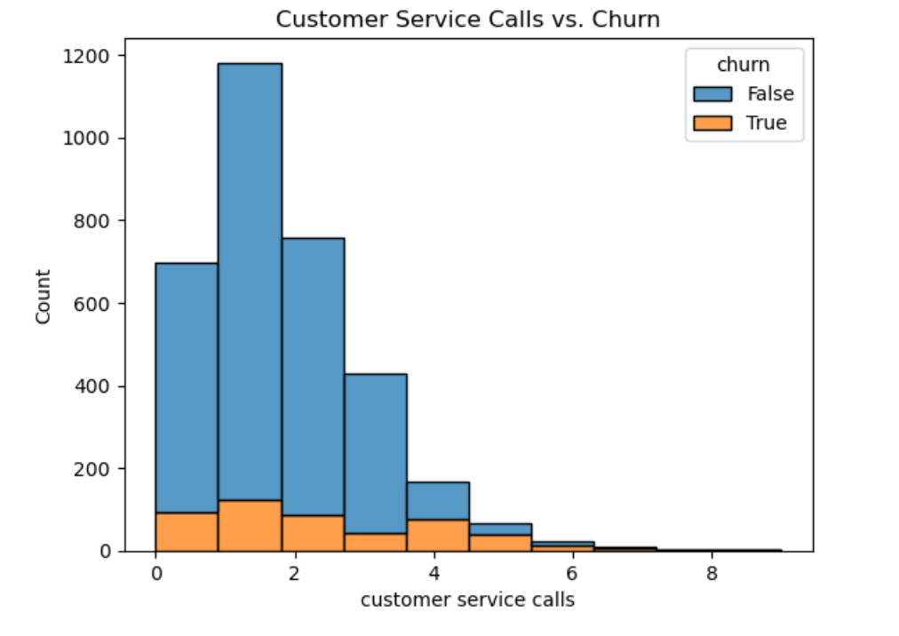
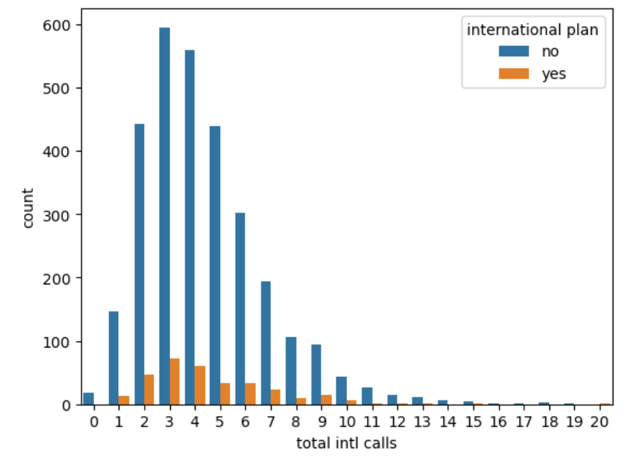
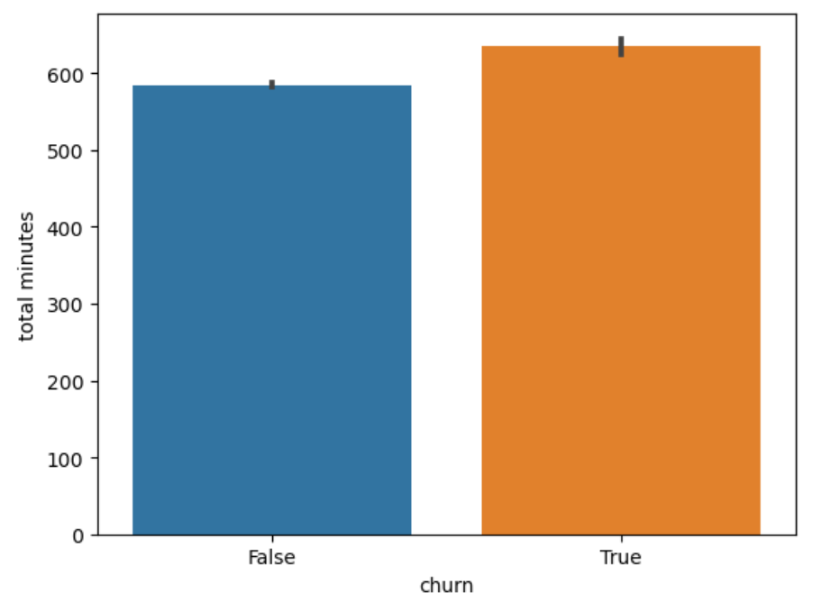
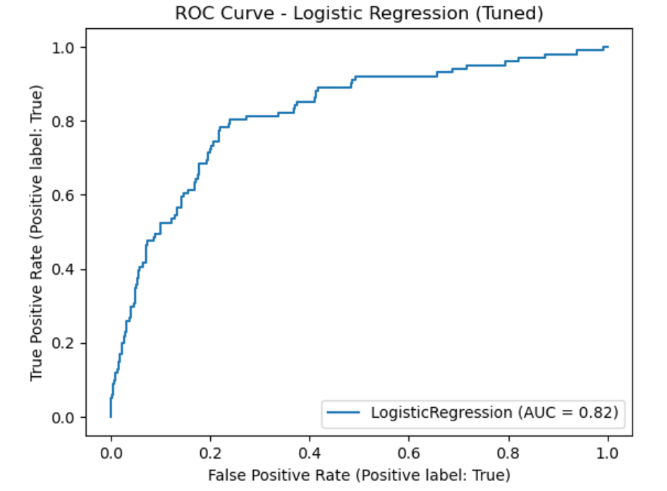
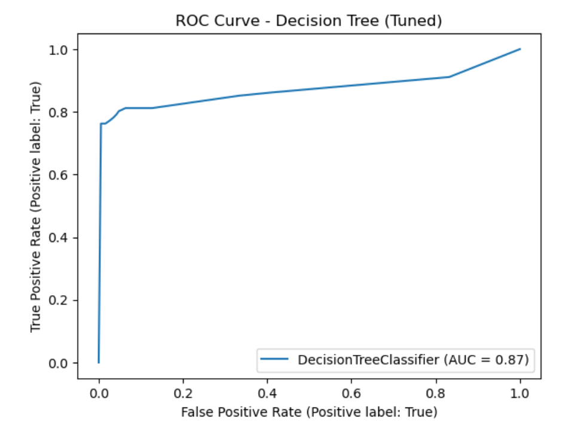
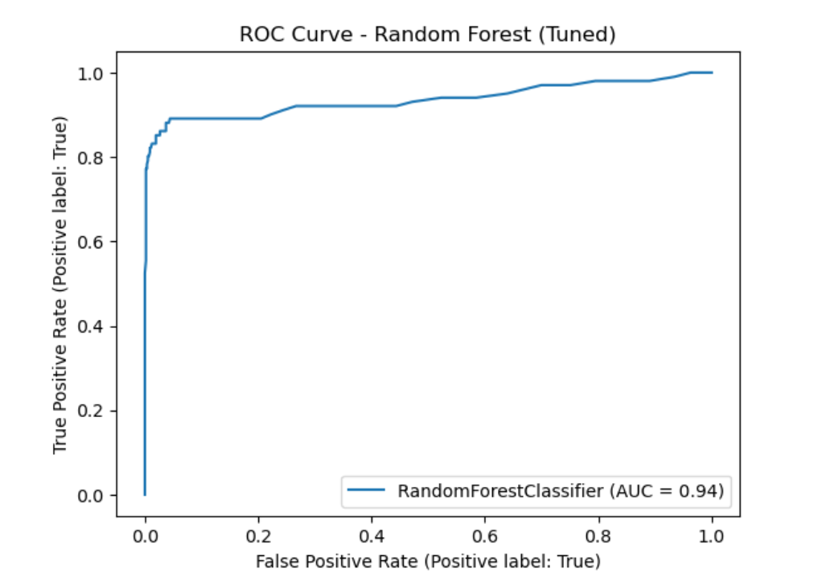
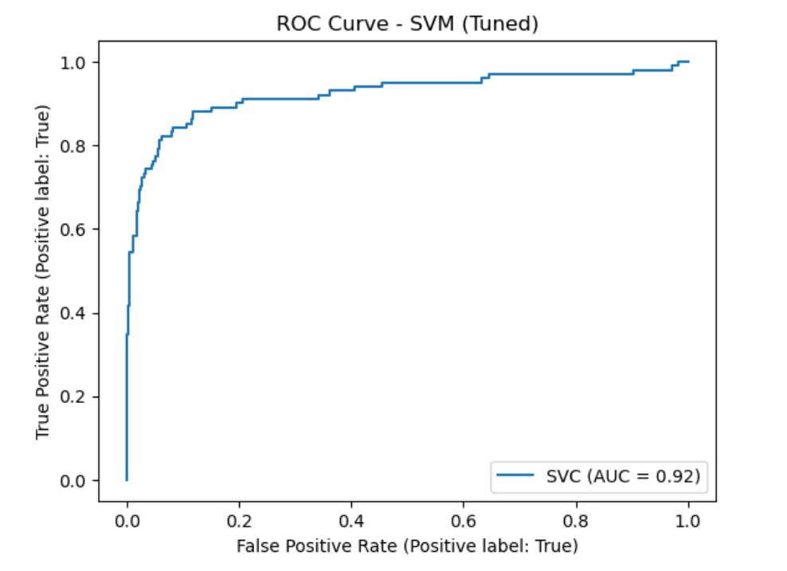
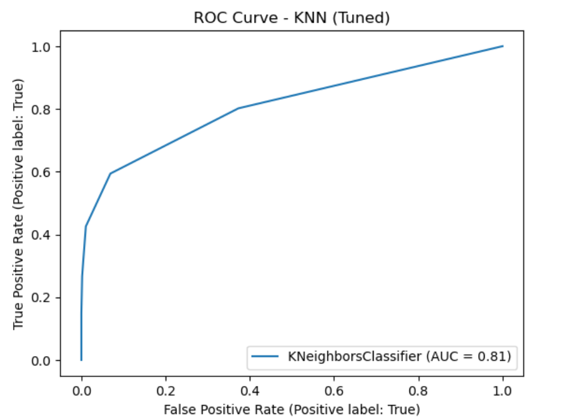
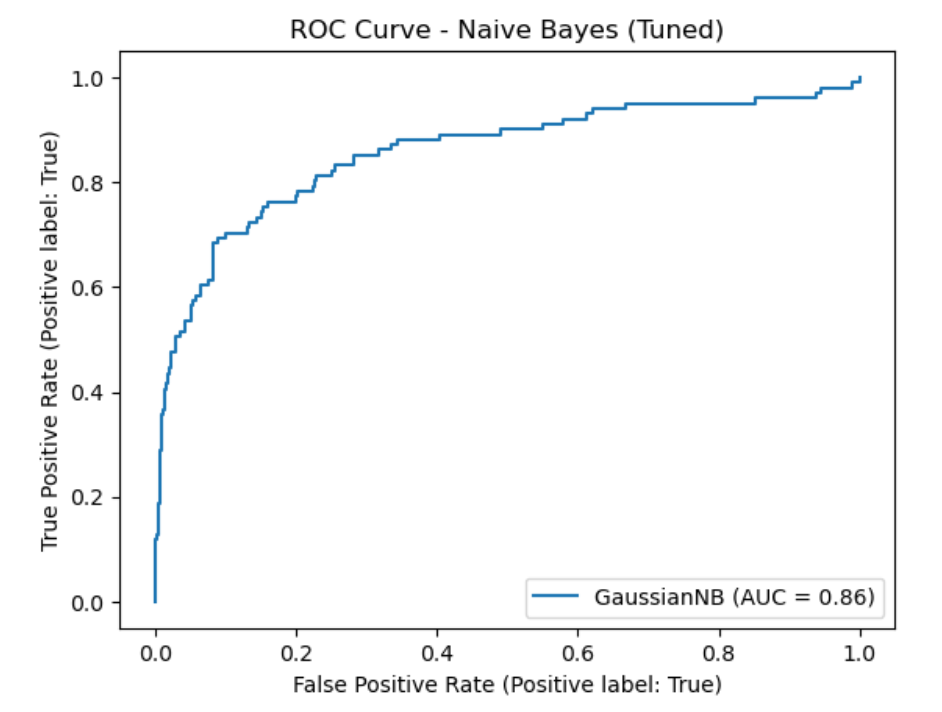

# Telecom Customer Churn Prediction Analysis

**Author:** Isaiah

---

## Overview

This analysis aims to predict customer churn for SyriaTel, a telecommunications company. By identifying customers likely to discontinue service, the study provides actionable insights to help the company implement targeted retention strategies. The notebook is structured to offer both an in-depth analysis of the customer data and compelling visualizations that highlight key patterns and trends.

---

## Business Problem

SyriaTel is facing revenue losses as customers discontinue their services. Without a clear understanding of the factors driving churn, the company cannot effectively address the underlying issues. This analysis:
- Identifies and examines patterns in customer behavior that signal potential churn.
- Provides visual evidence of these trends through various plots.
- Suggest areas where SyriaTel might improve its customer retention strategies.

---

## Objectives

- **Predict Customer Churn:** Utilize statistical and machine learning techniques to forecast which customers are most likely to leave.
- **Identify Key Drivers:** Understand the factors that contribute most significantly to customer churn.
- **Data Analysis:** Present clear and insightful visualizations to aid in the interpretation of the analysis.
- **Actionable Insights:** Provide recommendations to assist SyriaTel in reducing churn and minimizing revenue loss.

---

## Data Analysis & Methodology

The notebook follows a systematic approach to analyze customer churn:

1. **Data Exploration and Cleaning:**  
   The initial steps involve exploring the dataset, handling missing values, and ensuring that the data is in a suitable format for analysis.

2. **Feature Engineering:**  
   New variables are derived to better capture the nuances in customer behavior that may influence churn.

3. **Exploratory Data Analysis (EDA):**  
   Multiple visualizations are created to reveal patterns in the data. The EDA includes:
   - Distribution plots showing how key variables are spread across the customer base.
   - Correlation matrices that highlight relationships between variables.
   - Bar charts and histograms that compare churn rates across different customer segments.

4. **Predictive Modeling:**  
   A machine learning model is employed to predict churn. The process includes:
   - Splitting the data into training and testing sets.
   - Training a model using the identified features.
   - Evaluating model performance using relevant metrics.
  
5. **Evaluation and Interpretation:**  
   The final analysis interprets the model's performance and the significance of each variable. Insights drawn from the model guide strategic recommendations for customer retention.

---

## Visualizations Result

The notebook includes a series of visualizations designed to provide a clear, intuitive understanding of customer churn dynamics. Below are the embedded visualizations:

### Customer Service call Vs. Churn

### International call Vs. International plan

### Churn Vs. Total Minutes

### Logistic Regression

### Decision Tree

### Random Forest

### SVM

### KNN

### Naive Bayes

*Note: The visualizations above provide insights into the distribution of key variables, the correlations between them, and the performance of the predictive model.*

---

## Key Findings & Recommendations

The analysis uncovered several important insights:
- **Customer Segmentation:** Certain segments show significantly higher churn rates, suggesting targeted interventions could be highly effective.
- **Critical Variables:** Specific customer attributes (e.g., service usage patterns, billing issues) are strongly correlated with churn.
- **Predictive Insights:** The predictive model demonstrated a strong ability to forecast churn, indicating that proactive measures based on these predictions could mitigate revenue loss.

Based on these findings, SyriaTel is encouraged to:
- Develop tailored retention strategies for high-risk segments.
- Enhance customer engagement efforts, particularly among customers showing early signs of churn.
- Continuously monitor key performance indicators (KPIs) to dynamically adjust strategies as new data becomes available.

---

## Conclusion

This analysis provides a robust framework for understanding and predicting customer churn at SyriaTel. By combining detailed data exploration with visual insights and predictive modeling, the notebook offers a clear pathway for developing effective customer retention strategies. The visualizations make complex data accessible, enabling stakeholders to quickly grasp key trends and take action to reduce churn.

---

## For More Information
See the full analysis in the [Jupyter Notebook](./index.ipynb) or review this [presentation](./presentation.pdf).

For additional info, contact 
Isaiah at [isaiah.juma@student.moringaschool.com](mailto:isaiah.juma@student.moringaschool.com)
